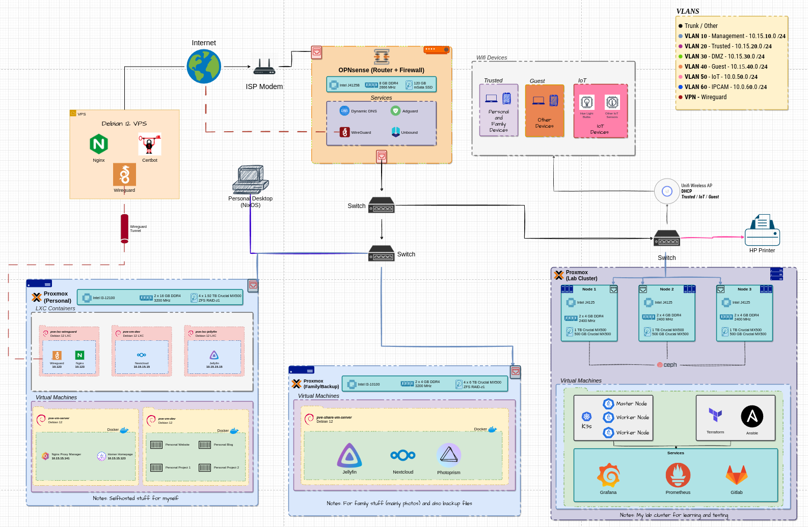

# My Home Server

My ongoing home network for running self-hosted applications (like Nextcloud) and storing other projects (eg. own static websites, etc.).

## Self-hosted Services

Currently still exploring more, these are just the main ones that I use regularly.

- Nextcloud
- Jellyfin
- Own stuff
  - Static websites (eg. portfolio website, blog posts, resume, etc.)

## Overall Network

The basic idea is that for accessing the home server outside of my local network, I use a VPS connected to my home server via Wireguard to access services externally if needed. I use Nginx as my reverse proxy in this scenario. This way I don't have to directly expose my network but rather tunnel my traffic through the VPS.

Most of my services are hosted on Proxmox through LXC or VM. See diagram below for a general idea of my home server.

Incomplete diagram below:

## Own Documentation

My own notes are in [documentation folder](./Documentation/).

### Helpful Resources

- Homeserver/Homelab/Self-hosted Forums:
  - Subreddits:
  - Lemmy Forums:
- Guides:
  - [Setup Nextcloud](https://www.youtube.com/watch?v=N5S3w-Z9Xvw&t=1171s)
- Youtube Channels:
  - [Lawrence Systems](https://www.youtube.com/@LAWRENCESYSTEMS)
  - [Techno Tim](https://www.youtube.com/results?search_query=technotim)
  - Many more
