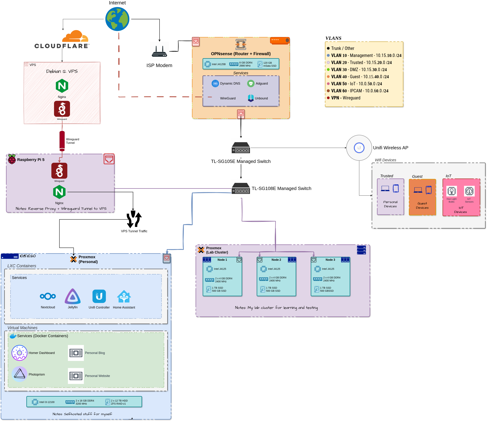

# My Home Lab

My ongoing home lab/server for learning and running self-hosted applications (Nextcloud, Jellyfin, etc).

## Self-hosted Services

Currently still exploring more.

Main Services Used:

- Nextcloud (Online Storage, Calendar, Tasks, etc.)
- Jellyfin (Music, Movies, Media)
- HomeAssistant (Smart Home)
- Unifi Controller (Control Unifi Network Equipment)
- Wireguard (VPN)
- Selfhosted Gitlab (Git Repo)
- Selfhosted Github Runners (Github Actions)
- Nginx (Reverse Proxy)
- Own stuff/projects
  - Web Dev Projects (eg. portfolio website, blog, etc.)
  - ML Projects (logo remover, image impainting, etc.)

## Overall Network

Basic overview diagram below:

## Own Documentation

My own notes are in [documentation folder](./Documentation/):

- Hardware Connections (ie. ports, switches) [here](./Documentation/Diagrams/HardwareConnections.drawio.png)

### Helpful Resources

- My Fav Forums:
  - Subreddits:
    - [Selfhosted](https://www.reddit.com/r/selfhosted/)
    - [Homelab](https://www.reddit.com/r/homelab/)
    - [Homeserver](https://www.reddit.com/r/HomeServer/)
    - [Minilab](https://www.reddit.com/r/minilab/)
    - [HomeNetwork](https://www.reddit.com/r/HomeNetworking)
  - Lemmy Forums:
    - Selfhosted
- Some Homelab Youtube Channels:
  - [Lawrence Systems](https://www.youtube.com/@LAWRENCESYSTEMS)
  - [Home Network Guy](https://www.youtube.com/@homenetworkguy)
  - [Techno Tim](https://www.youtube.com/results?search_query=technotim)
  - [Christian Lempa](https://www.youtube.com/@christianlempa)
  - [Linus Tech Tips](https://www.youtube.com/@LinusTechTips)
  - [apalrd's adventures](https://www.youtube.com/@apalrdsadventures)
  - [MRP](https://www.youtube.com/@MRPtech)
